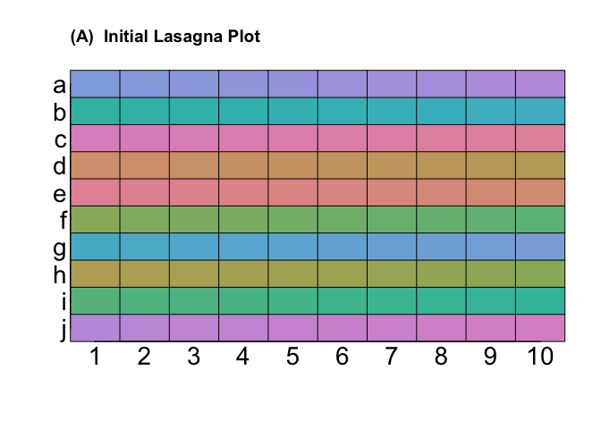

# lasagnar:  Lasagna plots R package
Bruce Swihart  
November 5, 2014  

[1] The original paper:  [Lasagna Plots: A Saucy Alternative to Spaghetti Plots](http://journals.lww.com/epidem/Fulltext/2010/09000/Lasagna_Plots__A_Saucy_Alternative_to_Spaghetti.15.aspx)

[2]  The follow-up paper for SAS code: [Lasagna Plots Made in Different (Statistical) Ovens](http://journals.lww.com/epidem/Fulltext/2012/11000/Lasagna_Plots_Made_in_Different__Statistical_.33.aspx)


There is an appendix for [1], but no one likes it.  At the time the only option for supplemental materials was to put R code into a PDF, thus introducing a hurdle for easy usage.  This repo on github has been long overdue.  This repo is an R-package, and can be installed with the following lines: 


```r
library(devtools)                                                                                                                                
install_github("swihart/lasagnar")                                                               
library(lasagnar)                                                                                                  
library(colorspace)                                                                                                                              
lasagna(matrix(1:100, nrow=10, ncol=10, byrow=TRUE)[sample(1:10),])
```

 

Note:  Windows machines will need to install [Rtools](http://cran.r-project.org/bin/windows/Rtools/).  All machines will need to have run `install.packages("devtools")` at the R prompt once.
